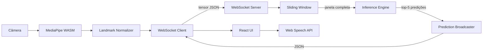
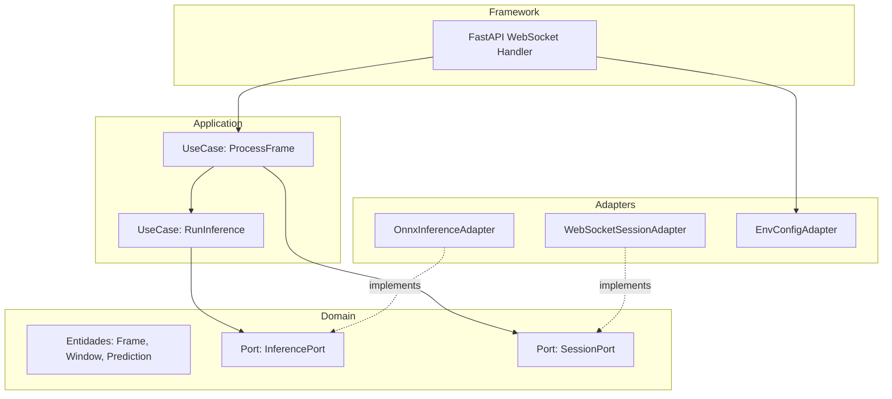

# Design Técnico — NeuroSign

## Visão Geral

O NeuroSign é uma aplicação web de tradução em tempo real de Língua de Sinais Americana (ASL) para texto e áudio. A arquitetura é dividida em três camadas principais:

1. **Cliente (React + TypeScript)**: captura vídeo, extrai e normaliza landmarks via MediaPipe (WebAssembly), e transmite tensores por WebSocket.
2. **Backend (FastAPI + ONNX Runtime)**: recebe tensores, acumula em sliding window, executa inferência e retorna predições.
3. **ML Lab (Python + PyTorch)**: pipeline reprodutível de preparação de dados, treinamento, exportação e quantização ONNX.

O fluxo de dados é unidirecional: câmera → landmarks → tensores → sliding window → inferência → predições → UI. Dados biométricos brutos (frames de vídeo) nunca saem do navegador.



---

## Arquitetura

### Estrutura do Monorepo

```
neurosign/
├── pyproject.toml              # workspace uv raiz
├── docker-compose.yml
├── README.md
├── ml-lab/
│   ├── pyproject.toml
│   ├── notebooks/              # experimentos (não importáveis)
│   └── neurosign_ml/           # módulos Python de produção
│       ├── data/               # download, filtragem, normalização, split
│       ├── models/             # definição da arquitetura LSTM+Atenção
│       ├── training/           # loop de treino, checkpoints, métricas
│       └── export/             # exportação ONNX, quantização, benchmark
└── apps/
    ├── backend/
    │   ├── pyproject.toml
    │   ├── Dockerfile
    │   └── neurosign_backend/
    │       ├── domain/         # entidades, ports (interfaces)
    │       ├── application/    # casos de uso (sliding window, orquestração)
    │       ├── adapters/       # ONNX Runtime, WebSocket, config
    │       └── main.py         # entrypoint FastAPI
    └── frontend/
        ├── package.json
        ├── Dockerfile
        └── src/
            ├── hooks/          # useMediaPipe, useWebSocket, usePredictions
            ├── components/     # VideoFeed, PredictionDisplay, Controls
            └── lib/            # normalizer, wsClient
```

### Padrão Arquitetural do Backend: Clean Architecture / Ports & Adapters



A camada de domínio não importa FastAPI, ONNX Runtime nem qualquer biblioteca de I/O. Os adaptadores satisfazem as interfaces (ports) definidas no domínio.

---

## Componentes e Interfaces

### Frontend

#### `LandmarkExtractor` (hook `useMediaPipe`)
- Inicializa `MediaPipe Hands` via WASM com `maxNumHands=2`
- Processa cada frame do `HTMLVideoElement` e emite `LandmarkFrame`
- Se nenhuma mão for detectada, emite tensor de zeros `float32[84]` (2 mãos × 21 landmarks × 2 coordenadas x,y)

#### `LandmarkNormalizer` (módulo `lib/normalizer.ts`)
```typescript
function normalize(raw: Float32Array): Float32Array
// 1. Translada: subtrai landmark[0] (pulso) de todos os pontos
// 2. Escala: divide pelo comprimento euclidiano entre landmark[0] e landmark[9]
// 3. Retorna Float32Array[84] normalizado
```

#### `WebSocketClient` (hook `useWebSocket`)
- Mantém conexão única persistente
- Serializa tensor como `number[]` em JSON: `{ "frame": [...] }`
- Reconexão com backoff exponencial: `delay = min(2^n * 1000ms, 30000ms)`
- Expõe `send(frame)` e `onMessage(handler)`

#### `PredictionDisplay` (componente React)
- Exibe `predictions[0].label` como tradução principal
- Em modo expandido, lista Top-5 com barras de confiança
- Atualiza estado em `useEffect` com debounce ≤ 100ms

### Backend

#### `InferencePort` (interface de domínio)
```python
class InferencePort(Protocol):
    def predict(self, window: np.ndarray) -> list[Prediction]: ...
    # window: shape (window_size, 84), dtype float32
    # retorna lista de Prediction ordenada por score desc
```

#### `SessionPort` (interface de domínio)
```python
class SessionPort(Protocol):
    def add_frame(self, session_id: str, frame: np.ndarray) -> Optional[np.ndarray]: ...
    # retorna janela completa quando buffer >= window_size, senão None
```

#### `SlidingWindowBuffer` (camada de aplicação)
- Implementa `SessionPort`
- Mantém `deque` por `session_id` com `maxlen=window_size`
- Emite janela quando `len(buffer) == window_size`
- Avança `stride` frames descartando os mais antigos

#### `OnnxInferenceAdapter` (adaptador)
- Carrega `InferenceSession` uma única vez na inicialização
- Executa `session.run(None, {"input": window_batch})`
- Aplica `softmax` na saída e retorna Top-5 como `list[Prediction]`
- Falha com `RuntimeError` descritivo se o arquivo `.onnx` não existir

#### `WebSocketHandler` (adaptador FastAPI)
```python
@app.websocket("/ws/{session_id}")
async def websocket_endpoint(websocket: WebSocket, session_id: str):
    # 1. Aceita conexão
    # 2. Loop: recebe JSON → deserializa → add_frame → se janela: predict → broadcast
    # 3. Trata desconexão graciosamente
```

#### `EnvConfig` (adaptador de configuração)
```python
@dataclass
class EnvConfig:
    window_size: int      # WINDOW_SIZE, obrigatório
    stride: int           # STRIDE, obrigatório
    model_path: Path      # MODEL_PATH, obrigatório
    host: str             # HOST, default "0.0.0.0"
    port: int             # PORT, default 8000
```
Valida na inicialização e encerra com lista de variáveis ausentes se inválido.

### ML Lab

#### `DataPipeline` (`neurosign_ml/data/`)
- `download.py`: baixa WLASL via `kaggle` API com credenciais de env
- `filter.py`: seleciona top-50 sinais por frequência
- `normalize.py`: aplica mesma normalização do frontend (origem pulso, escala landmark 9)
- `split.py`: divide treino/val/teste sem vazamento de sinal entre conjuntos
- `dataset.py`: `torch.utils.data.Dataset` que carrega tensores serializados

#### `BiLSTMAttention` (`neurosign_ml/models/`)
```python
class BiLSTMAttention(nn.Module):
    # Encoder: BiLSTM (hidden_size, num_layers)
    # Attention: dot-product sobre hidden states
    # Classifier: Linear(hidden_size*2 → num_classes)
```

#### `Trainer` (`neurosign_ml/training/`)
- Loop de treino com suporte a `device = mps | cuda | cpu`
- Salva top-3 checkpoints por `val_top1`
- Loga métricas em formato CSV + TensorBoard `SummaryWriter`
- Retomada via `--resume checkpoint.pt`

#### `Exporter` (`neurosign_ml/export/`)
- `export_onnx.py`: `torch.onnx.export` com opset 17
- `quantize.py`: `onnxruntime.quantization.quantize_static` Float32 → Int8
- `benchmark.py`: mede P50/P95 em 100 amostras de teste
- `validate.py`: compara Top-1 Float32 vs Int8, falha se delta > 2pp

---

## Modelos de Dados

### Tensor de Frame (Frontend → Backend)

```typescript
// Mensagem WebSocket enviada pelo cliente
interface FrameMessage {
  frame: number[];  // Float32Array serializada, length=84
                    // [hand0_lm0_x, hand0_lm0_y, ..., hand1_lm20_x, hand1_lm20_y]
}
```

Layout: `[mão0_lm0_x, mão0_lm0_y, mão0_lm1_x, ..., mão1_lm20_x, mão1_lm20_y]`
Dimensão: `2 mãos × 21 landmarks × 2 coords = 84 floats`

### Janela Temporal (Sliding Window → Inference Engine)

```python
# numpy array
window: np.ndarray  # shape: (window_size, 84), dtype: float32
```

### Predição (Backend → Frontend)

```typescript
// Mensagem WebSocket recebida pelo cliente
interface PredictionMessage {
  predictions: Array<{
    label: string;       // ex: "hello"
    confidence: number;  // [0.0, 1.0]
    rank: number;        // 1-5
  }>;
  session_id: string;
  timestamp_ms: number;
}
```

### Entidades de Domínio (Python)

```python
@dataclass(frozen=True)
class Prediction:
    label: str
    confidence: float  # [0.0, 1.0]
    rank: int          # 1-5

@dataclass(frozen=True)
class InferenceResult:
    predictions: tuple[Prediction, ...]  # sempre 5 elementos
    latency_ms: float
```

### Checkpoint do Modelo (ML Lab)

```python
# Salvo via torch.save
{
    "epoch": int,
    "model_state_dict": dict,
    "optimizer_state_dict": dict,
    "val_top1": float,
    "val_top5": float,
    "config": dict,  # hiperparâmetros do modelo
}
```

---

## Propriedades de Corretude

*Uma propriedade é uma característica ou comportamento que deve ser verdadeiro em todas as execuções válidas de um sistema — essencialmente, uma declaração formal sobre o que o sistema deve fazer. Propriedades servem como ponte entre especificações legíveis por humanos e garantias de corretude verificáveis por máquina.*

### Reflexão sobre Redundâncias

Antes de listar as propriedades, identificamos as seguintes redundâncias:

- **1.2 e 1.3** (translação e escala) são duas etapas da mesma função `normalize()`. Podem ser combinadas em uma única propriedade de round-trip da normalização.
- **3.3 e 3.5** (emissão quando buffer cheio / retenção quando buffer incompleto) são complementares e cobertos pela mesma propriedade de invariante do sliding window.
- **6.3** (normalização no ML Pipeline) é a mesma função de 1.2/1.3, coberta pela Propriedade 1.
- **9.5** (variáveis ausentes) e **4.4** (modelo não encontrado) são ambos casos de validação de configuração; mantidos separados por terem naturezas distintas (subconjunto de variáveis vs. arquivo específico).

---

### Propriedade 1: Normalização preserva invariantes geométricos

*Para qualquer* conjunto de landmarks de mão com distância não-zero entre o pulso (landmark 0) e a base do dedo médio (landmark 9), após aplicar a normalização: (a) o landmark 0 deve ser exatamente (0.0, 0.0), e (b) a distância euclidiana entre landmark 0 e landmark 9 deve ser exatamente 1.0.

**Valida: Requisitos 1.2, 1.3, 6.3**

---

### Propriedade 2: Serialização de tensor preserva valores

*Para qualquer* `Float32Array` de dimensão 84 representando um frame normalizado, serializar como JSON e desserializar deve produzir um array com os mesmos valores numéricos (dentro da precisão de ponto flutuante de 32 bits).

**Valida: Requisito 2.1**

---

### Propriedade 3: Backoff exponencial respeita limites

*Para qualquer* número de tentativa de reconexão `n >= 0`, o delay calculado deve ser igual a `min(2^n * 1000, 30000)` milissegundos, garantindo que nunca exceda 30 segundos e que cresça exponencialmente até o limite.

**Valida: Requisito 2.3**

---

### Propriedade 4: Isolamento de sessão no sliding window

*Para quaisquer* dois `session_id` distintos, adicionar frames a uma sessão não deve alterar o estado do buffer da outra sessão. O tamanho do buffer de cada sessão deve ser independente.

**Valida: Requisito 2.5**

---

### Propriedade 5: Sliding window emite janela no momento correto

*Para qualquer* `window_size` configurado e qualquer sequência de frames, o sliding window deve emitir exatamente uma janela com shape `(window_size, 84)` quando o buffer atingir `window_size` frames, e não emitir nada enquanto o buffer tiver menos que `window_size` frames.

**Valida: Requisitos 3.1, 3.3, 3.5**

---

### Propriedade 6: Sliding window avança corretamente após emissão

*Para qualquer* par `(window_size, stride)` com `stride <= window_size`, após a emissão de uma janela, o buffer deve conter exatamente `window_size - stride` frames (os mais recentes), prontos para a próxima janela.

**Valida: Requisito 3.4**

---

### Propriedade 7: Inference Engine retorna Top-5 válido e ordenado

*Para qualquer* janela de entrada com shape `(window_size, 84)` e dtype `float32`, o Inference Engine deve retornar exatamente 5 predições onde: (a) os scores de confiança estão em ordem decrescente, (b) cada score está no intervalo `[0.0, 1.0]`, e (c) a soma dos scores é `<= 1.0`.

**Valida: Requisito 4.2**

---

### Propriedade 8: Serialização de predição contém todos os campos obrigatórios

*Para qualquer* `InferenceResult` com 5 predições, o JSON serializado pelo Prediction Broadcaster deve conter os campos `predictions` (array de 5 elementos com `label`, `confidence` e `rank`), `session_id` e `timestamp_ms`.

**Valida: Requisito 5.1**

---

### Propriedade 9: Validação de configuração lista todas as variáveis ausentes

*Para qualquer* subconjunto não-vazio de variáveis de ambiente obrigatórias ausentes (`WINDOW_SIZE`, `STRIDE`, `MODEL_PATH`), a mensagem de erro de inicialização do Backend deve mencionar explicitamente cada uma das variáveis ausentes.

**Valida: Requisito 9.5**

---

### Propriedade 10: Degradação de acurácia na quantização é aceitável

*Para qualquer* conjunto de amostras de teste do WLASL, a diferença absoluta entre a Top-1 Accuracy do modelo Float32 e do modelo Int8 quantizado deve ser inferior a 2 pontos percentuais.

**Valida: Requisito 8.5**

---

## Tratamento de Erros

### Frontend

| Situação | Comportamento |
|---|---|
| Câmera negada pelo usuário | Exibe mensagem de permissão negada, desabilita botão de início |
| MediaPipe falha ao carregar WASM | Exibe erro de carregamento, sugere recarregar a página |
| WebSocket desconectado | Exibe indicador de reconexão, inicia backoff exponencial |
| WebSocket rejeitado pelo servidor | Exibe mensagem de erro descritiva, para tentativas de reconexão |
| Nenhuma mão detectada | Emite tensor de zeros silenciosamente (sem erro para o usuário) |
| Predição não recebida em > 5s | Exibe indicador de "aguardando sinal" |

### Backend

| Situação | Comportamento |
|---|---|
| `MODEL_PATH` não encontrado na inicialização | `RuntimeError` com mensagem descritiva, processo encerra com código 1 |
| Variável de ambiente obrigatória ausente | Lista todas as variáveis ausentes, processo encerra com código 1 |
| JSON inválido recebido via WebSocket | Loga warning, fecha conexão com código 1003 (Unsupported Data) |
| Tensor com dimensão incorreta | Loga warning, descarta frame, mantém conexão |
| Erro durante inferência ONNX | Loga erro com stack trace, retorna erro ao cliente via WebSocket, mantém sessão |
| Cliente desconecta abruptamente | Limpa buffer da sessão, loga info |

### ML Lab

| Situação | Comportamento |
|---|---|
| Credenciais Kaggle ausentes | `ValueError` descritivo antes de iniciar download |
| Checkpoint não encontrado para retomada | `FileNotFoundError` com caminho esperado |
| Delta de acurácia Float32 vs Int8 > 2pp | `AssertionError` com valores reais, interrompe exportação |
| Modelo ONNX > 10MB após quantização | Warning com tamanho real, não interrompe o processo |

---

## Estratégia de Testes

### Abordagem Dual

O projeto usa testes baseados em exemplos para comportamentos específicos e testes baseados em propriedades para invariantes universais. Os dois são complementares.

### Biblioteca de Property-Based Testing

- **Python (backend + ml-lab)**: `hypothesis` (>=6.0)
- **TypeScript (frontend)**: `fast-check` (>=3.0)

Cada teste de propriedade deve executar no mínimo **100 iterações**.

### Testes Unitários (exemplos e casos de borda)

**Frontend (`vitest` + `@testing-library/react`)**:
- `normalizer.test.ts`: caso normal, mão ausente (zeros), landmarks em posições extremas
- `wsClient.test.ts`: conexão única, reconexão após queda, rejeição de conexão
- `PredictionDisplay.test.tsx`: exibição de tradução principal, modo expandido, síntese de voz

**Backend (`pytest`)**:
- `test_onnx_adapter.py`: carregamento único do modelo, modelo não encontrado
- `test_websocket_handler.py`: JSON inválido, tensor com dimensão errada, desconexão abrupta
- `test_env_config.py`: todas as variáveis presentes, variáveis ausentes

**ML Lab (`pytest`)**:
- `test_data_pipeline.py`: filtragem top-50, split sem vazamento
- `test_export.py`: tamanho do arquivo ONNX, benchmark de latência

### Testes de Propriedade

Cada teste referencia a propriedade do design com o formato:
`# Feature: neurosign, Property N: <texto da propriedade>`

**Frontend (`fast-check`)**:

```typescript
// Feature: neurosign, Property 1: Normalização preserva invariantes geométricos
test.prop([fc.array(fc.float(), { minLength: 84, maxLength: 84 })])(
  'normalize sets wrist to origin and hand size to 1',
  (landmarks) => { ... }
)

// Feature: neurosign, Property 2: Serialização de tensor preserva valores
// Feature: neurosign, Property 3: Backoff exponencial respeita limites
```

**Backend (`hypothesis`)**:

```python
# Feature: neurosign, Property 4: Isolamento de sessão no sliding window
@given(st.text(), st.text(), arrays(float32, shape=(84,)))
def test_session_isolation(session_a, session_b, frame): ...

# Feature: neurosign, Property 5: Sliding window emite janela no momento correto
# Feature: neurosign, Property 6: Sliding window avança corretamente após emissão
# Feature: neurosign, Property 7: Inference Engine retorna Top-5 válido e ordenado
# Feature: neurosign, Property 8: Serialização de predição contém todos os campos
# Feature: neurosign, Property 9: Validação de configuração lista variáveis ausentes
```

**ML Lab (`hypothesis`)**:

```python
# Feature: neurosign, Property 10: Degradação de acurácia na quantização é aceitável
# Feature: neurosign, Property 1: Normalização preserva invariantes geométricos (validação cruzada)
```

### Testes de Integração

- **Fluxo WebSocket completo**: envio de tensor → sliding window → inferência (modelo stub) → resposta JSON, usando `pytest-asyncio` e `httpx`
- **Pipeline ML end-to-end**: download → filtragem → normalização → split → treinamento (1 época, subset pequeno) → exportação ONNX

### Testes de Smoke

- Backend inicializa corretamente com todas as variáveis de ambiente definidas
- `docker-compose up` sobe todos os serviços sem erros
- Benchmark de latência ONNX: P50 < 50ms, P95 < 100ms em CPU

---

## Roadmap de Evolução do Modelo (Dual-Stream)

### Baseline atual: BiLSTM + Atenção sobre landmarks das mãos

- Input: 84 features/frame (21 landmarks × 2 mãos × 2 coords)
- Resultado esperado: ~47-50% top-1 no WLASL-100

### Fase 2: Holistic Landmarks (implementado)

- Input: 150 features/frame (mãos 84 + pose corporal 66)
- Extração via MediaPipe Holistic no pipeline de dados
- Resultado esperado: ~60-70% top-1 no WLASL-100
- Melhorias adicionais: data augmentation (ruído, flip, time warp), cosine annealing, label smoothing

### Fase 3: Dual-Stream (trabalho futuro — caminho para 80%+)

A literatura (SPOTER, SignBERT, SMKD) mostra que combinar landmarks com features visuais é o que empurra para 80%+. A arquitetura proposta:

```
Vídeo → CNN (ResNet-18 frozen) → features visuais (T, 512)
                                                          ↘
                                                    Fusion Layer → BiLSTM+Atenção → Classificador
                                                          ↗
Vídeo → MediaPipe Holistic → landmarks normalizados (T, 150)
```

**Componentes:**

- `VisualEncoder`: ResNet-18 pré-treinado (ImageNet), extrai features do frame central de cada janela temporal. Frozen nos primeiros epochs, fine-tuned depois.
- `LandmarkEncoder`: BiLSTM bidirecional com atenção (arquitetura atual).
- `FusionLayer`: concatenação + projeção linear `(512 + hidden*2) → hidden*2`, seguida de dropout.
- `Classifier`: Linear `hidden*2 → num_classes`.

**Implementação estimada:** 2-3 dias de trabalho.

**Referências:**
- SPOTER: Sign Pose-based Transformer for Word-level Sign Language Recognition (ICCVW 2021)
- SignBERT: Pre-Training of Hand-Model-Aware Representation for Sign Language Recognition (ICCV 2021)
- SMKD: Self-Mutual Distillation Learning for Continuous Sign Language Recognition (ICCV 2021)
