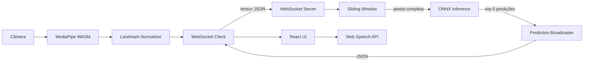

# NeuroSign

NeuroSign é uma aplicação web de tradução em tempo real de Língua de Sinais Americana (ASL) para texto e áudio. O processamento de landmarks acontece inteiramente no navegador via MediaPipe WebAssembly — frames de vídeo nunca saem do dispositivo do usuário. Os tensores normalizados são transmitidos por WebSocket para um backend FastAPI que executa inferência com um modelo BiLSTM+Atenção exportado em ONNX.

---

<!-- Substitua pelo GIF/vídeo demonstrativo após o treinamento -->

> 📹 **Demo**: _em breve — adicione um GIF ou link de vídeo aqui_

---

## Fluxo de Dados



---

## Stack Tecnológica

| Camada                        | Tecnologia                                |
| ----------------------------- | ----------------------------------------- |
| Frontend                      | React 18, TypeScript, Vite                |
| Captura de landmarks          | MediaPipe Hands (WebAssembly)             |
| Comunicação                   | WebSocket (JSON)                          |
| Backend                       | FastAPI, Uvicorn                          |
| Inferência                    | ONNX Runtime                              |
| Modelo                        | BiLSTM + Atenção (PyTorch → ONNX Int8)    |
| Dataset                       | WLASL (Word-Level American Sign Language) |
| Treinamento                   | PyTorch, TensorBoard                      |
| Containerização               | Docker, Docker Compose                    |
| Gerenciador de pacotes Python | uv                                        |

---

## Quick Start

### Pré-requisitos

- [Docker](https://docs.docker.com/get-docker/) com Docker Compose v2
- Arquivo do modelo em `./models/neurosign_int8.onnx` (veja seção ML Lab)

### Subir tudo com um comando

```bash
docker compose up
```

- Frontend: http://localhost:3000
- Backend (API + WebSocket): http://localhost:8000

---

## Desenvolvimento Local

### Backend

Requer [uv](https://docs.astral.sh/uv/) e Python 3.11+.

```bash
# Instalar dependências
uv sync

# Rodar o servidor
cd apps/backend
uv run uvicorn neurosign_backend.main:app --reload --host 0.0.0.0 --port 8000
```

Variáveis de ambiente necessárias (crie um `.env` em `apps/backend/`):

```env
WINDOW_SIZE=30
STRIDE=5
MODEL_PATH=../../models/neurosign_int8.onnx
```

### Frontend

Requer Node.js 20+.

```bash
cd apps/frontend
npm install
npm run dev
```

A variável `VITE_WS_URL` pode ser definida em `apps/frontend/.env.local`:

```env
VITE_WS_URL=ws://localhost:8000/ws
```

---

## ML Lab

### Pré-requisitos

- Credenciais da [API Kaggle](https://www.kaggle.com/docs/api) em `~/.kaggle/kaggle.json`
- uv instalado

```bash
cd ml-lab
uv sync
```

### Download do dataset

```bash
uv run python -m neurosign_ml.data.download
```

### Treinamento

```bash
uv run python -m neurosign_ml.training.trainer \
  --epochs 50 \
  --hidden-size 256 \
  --num-layers 2
```

Para retomar de um checkpoint:

```bash
uv run python -m neurosign_ml.training.trainer --resume checkpoints/best.pt
```

### Exportação ONNX e quantização Int8

```bash
uv run python -m neurosign_ml.export.export_onnx --checkpoint checkpoints/best.pt
uv run python -m neurosign_ml.export.quantize --input model.onnx --output models/neurosign_int8.onnx
uv run python -m neurosign_ml.export.validate --float32 model.onnx --int8 models/neurosign_int8.onnx
```

---

## Métricas de Performance

> _Preencher após o treinamento e exportação do modelo._

| Métrica                       | Float32 | Int8 |
| ----------------------------- | ------- | ---- |
| Top-1 Accuracy (WLASL top-50) | —       | —    |
| Top-5 Accuracy (WLASL top-50) | —       | —    |
| Tamanho do modelo             | —       | —    |
| Latência P50 (CPU)            | —       | —    |
| Latência P95 (CPU)            | —       | —    |

---

## Licença

MIT © NeuroSign Contributors
